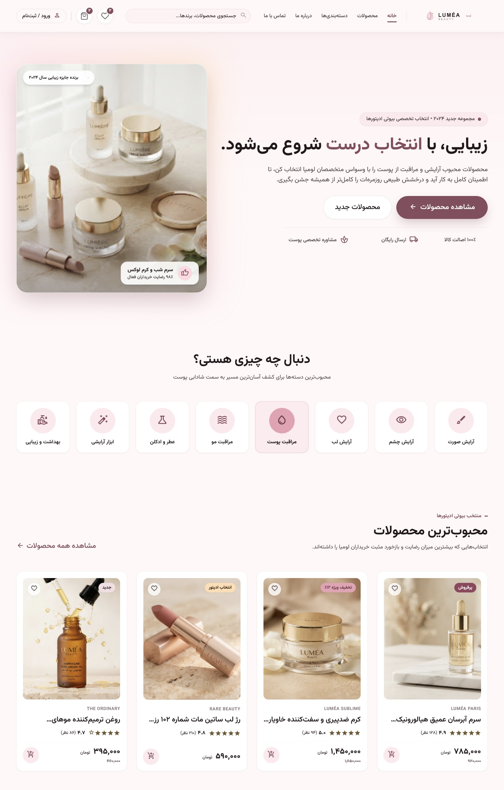

# LUMÉA Beauté (LUMÉA Paris) 🌸✨

> **A Luxury Skincare, High-End Cosmetics & Fine Fragrance E-Commerce Web Application**  
> Designed with meticulous Persian (RTL) typography, responsive editorial layout, and state-of-the-art frontend architecture.

---

## 📖 Overview

**LUMÉA Beauté** is a luxury digital boutique tailored for premium skincare, high-end cosmetics, and bespoke fragrances. It delivers a fast, responsive, and tactile shopping experience inspired by international luxury brands and dermatological aesthetics.

The platform features full RTL (Right-to-Left) support, bespoke Persian typography powered by **Vazirmatn**, offline self-contained local visual assets, dynamic cart and checkout flows, interactive skin consultation modals, and authenticity verification mechanisms.

---

## 📸 Preview



## 📝 Note About This Version

This is the free and public version of the LUMÉA Beauté project, created to be shared on GitHub and used as a customizable starting point.

This version may differ from my personal version in some visual and design details, including images, spacing, layouts, hover effects, and other UI elements.

Feel free to replace the images, adjust the layout and spacing, modify hover effects, and customize the design to fit your own needs.

---

## 🛠 Tech Stack & Core Technologies


### 1. **Frontend Framework & Language**
- **React 19** (`react`, `react-dom`): Latest React architecture utilizing functional components and modern hooks.
- **TypeScript 5+** (`typescript`, `tsx`): Strict type checking, robust data models (`Product`, `Category`, `Article`, `Order`, `Review`), and type-safe state interfaces.
- **Vite 8** (`vite`, `@vitejs/plugin-react`): Lightning-fast development server with instant HMR and optimized production bundling.

### 2. **Styling & Design System**
- **Tailwind CSS v4** (`@tailwindcss/vite`, `tailwindcss`): The modern CSS engine with declarative CSS `@theme` variables for brand palettes (rose gold, blush, deep wine, champagne gold).
- **Typography**:
  - **Vazirmatn**: Primary Persian font for headers, descriptions, and UI text.
  - **Plus Jakarta Sans**: Secondary Latin font for English brand names, batch codes, and numeric accents.
- **Unified Icon System**: Custom `<Icon />` wrapper bridging **Lucide React** (`lucide-react`) and standard semantic symbols.
- **Motion & Interactions**:
  - `motion` (Framer Motion engine) for smooth page transitions and micro-interactions.
  - `canvas-confetti` for celebratory feedback upon order placements and club memberships.

### 3. **State Management & Routing**
- **Zustand** (`zustand`): Lightweight, boilerplate-free global store (`useStore`) handling:
  - Client-side navigation & history (`currentPath`, route params).
  - Shopping Cart with persistence, quantities, and tiered luxury gift selections.
  - Wishlist management.
  - Toast notifications and system feedback.
  - Interactive Skin Diagnosis Quiz modal state.
  - Mobile menu drawers and interactive UI toggles.

### 4. **AI & Extensibility Ready**
- **Google GenAI SDK** (`@google/genai`): Ready for server-side or assisted skincare routine consultations and smart product recommendations.

---

## 📁 Project Structure

```plaintext
├── index.html                   # HTML entry point (SEO metadata, Vazirmatn fonts)
├── metadata.json                # Project identity and manifest
├── package.json                 # Project dependencies & scripts
├── tsconfig.json                # TypeScript compiler configuration
├── vite.config.ts               # Vite configuration with Tailwind CSS v4 plugin
├── public/                      # Static assets served directly
│   └── images/                  # 100% Local, offline visual assets
│       ├── articles/            # Magazine & skincare guide covers
│       ├── avatars/             # User and testimonial portraits
│       ├── banners/             # Editorial banners, logos, and boutique showcases
│       ├── brands/              # Brand logos (The Ordinary, Rare Beauty, etc.)
│       ├── categories/          # High-resolution category cards
│       ├── products/            # Multi-angle product imagery and packaging
│       └── team/                # Dermatology and beauty expert portraits
└── src/
    ├── main.tsx                 # React application mounting point
    ├── App.tsx                  # Root component, router switcher, toasts & modals
    ├── index.css                # Global CSS, Tailwind v4 theme tokens, font definitions
    ├── types/
    │   └── index.ts             # Central TypeScript interfaces & data types
    ├── store/
    │   └── useStore.ts          # Zustand global store (Cart, Route, Wishlist, Modals)
    ├── data/
    │   └── mockData.ts          # Seed data (Products, Categories, Articles, Reviews)
    ├── components/
    │   ├── Header.tsx           # Luxury sticky header with branding & desktop navigation
    │   ├── Footer.tsx           # Comprehensive footer with links, trust badges & license
    │   ├── MobileBottomNav.tsx  # Sticky bottom navigation bar for mobile viewports
    │   ├── MobileDrawer.tsx     # Slide-over navigation drawer for mobile devices
    │   ├── SkinQuizModal.tsx    # Interactive multi-step diagnostic skincare quiz
    │   └── ui/
    │       └── Icon.tsx         # Unified Icon component with fallback mapping
    └── pages/
        ├── HomePage.tsx         # Editorial hero banner, popular picks, quiz banner, articles
        ├── ProductsCatalogPage.tsx # Filterable catalog with search, price sliders & sorting
        ├── ProductDetailPage.tsx   # Detailed product gallery, batch code, tabs & reviews
        ├── CartCheckoutPage.tsx    # Cart management, tiered free gifts, promo codes & checkout
        ├── AboutPage.tsx        # Brand philosophy, milestones, clinical board & standards
        ├── ContactPage.tsx      # Concierge contact, consultation form & boutique directions
        ├── BrandsPage.tsx       # Curated brand showcase
        ├── WishlistPage.tsx     # Saved products collection
        └── ProfileDashboardPage.tsx # User profile, orders, addresses & skin profile
```

---

## ✨ Key Features

1. **Editorial Luxury Homepage**:
   - High-impact editorial hero banner showcasing signature products.
   - Dynamic badges highlighting beauty awards and customer satisfaction ratings.
   - Quick-access Category Slider.
   - Curated sections for Trending Luxury Picks and New Arrivals.
   - Interactive Skincare Guide & Magazine Articles.

2. **Smart Product Catalog & Filtering**:
   - Instant filtering by Category, Brand, Price range, and Skin Concern.
   - Multi-option sorting (Popularity, Price low-to-high / high-to-low, Top rated).
   - In-stock availability filters and quick add-to-bag shortcuts.

3. **In-Depth Product Experience (`ProductDetailPage`)**:
   - Multi-image zoom and thumbnail gallery.
   - Volume and Shade selection with dynamic pricing updates.
   - Authentic Batch Code (بچ‌کد) display for authenticity verification.
   - Clinical efficacy notes, ingredient analysis, and usage instructions.
   - Verified customer ratings and reviews.

4. **Interactive Luxury Cart & Checkout**:
   - Real-time price breakdown and discount calculations.
   - **Tiered Gift Selector**: Customers unlock complimentary luxury samples (e.g. cherry blossom perfume, night repair serums) based on order value.
   - Coupon / voucher code validation.
   - Address selection and express courier time-slot picker.

5. **Skin Diagnostic Quiz (`SkinQuizModal`)**:
   - Guided multi-step assessment analyzing skin type, primary concerns (hydration, anti-aging, acne, sensitivity), and texture preferences.
   - Tailored routine recommendations based on user answers.

6. **Dedicated About & Concierge Support**:
   - Comprehensive **About Us** page highlighting brand history, European import standards, clean formulations, and the expert clinical board.
   - **Contact Us** page with direct department extensions, expedited callback form, boutique directions, and interactive FAQ accordions.

7. **100% Local & Self-Contained Assets**:
   - All 46+ images across the application are stored locally in `/public/images/`, guaranteeing offline availability and fast load times with no external dependencies.

---

## 🚀 Getting Started (Installation & Local Development)

Follow these steps to run the project locally on your machine:

### Prerequisites
- [Node.js](https://nodejs.org/) (Version **18.0.0** or higher recommended)
- `npm`, `pnpm`, or `bun` package manager

### 1. Clone or Extract the Project
Open your terminal and navigate to the project directory:
```bash
cd lumea-beauty
```

### 2. Install Dependencies
```bash
npm install
```

### 3. Start Development Server
```bash
npm run dev
```
The application will launch on `http://localhost:3000`.

### 4. Build for Production
To create an optimized production build:
```bash
npm run build
```
The compiled static assets will be located in the `dist/` directory.

### 5. Preview Production Build
```bash
npm run preview
```

### 6. Code Linting & Type Checking
```bash
npm run lint
```

---

## 🎨 Design Tokens & Theme Configuration

The styling is governed by custom Tailwind CSS v4 design tokens defined in `src/index.css`:

| Token | Color / Style | Purpose |
| :--- | :--- | :--- |
| `--color-primary` | `#884c5e` | Signature LUMÉA Deep Rose / Velvet Berry |
| `--color-primary-container` | `#e9a0b3` | Soft Rose Highlight |
| `--color-secondary` | `#94445c` | Rich Wine |
| `--color-tertiary` | `#745a33` | Champagne Gold |
| `--color-surface` | `#fff8f8` | Warm Porcelain Canvas |
| `--color-surface-container` | `#fde9ed` | Blush Background Card |
| `--font-sans` | `'Vazirmatn', sans-serif` | Clean, high-legibility Persian Typography |

---

## 📄 License
Private & Proprietary — Developed for **LUMÉA Beauté**. All rights reserved.
